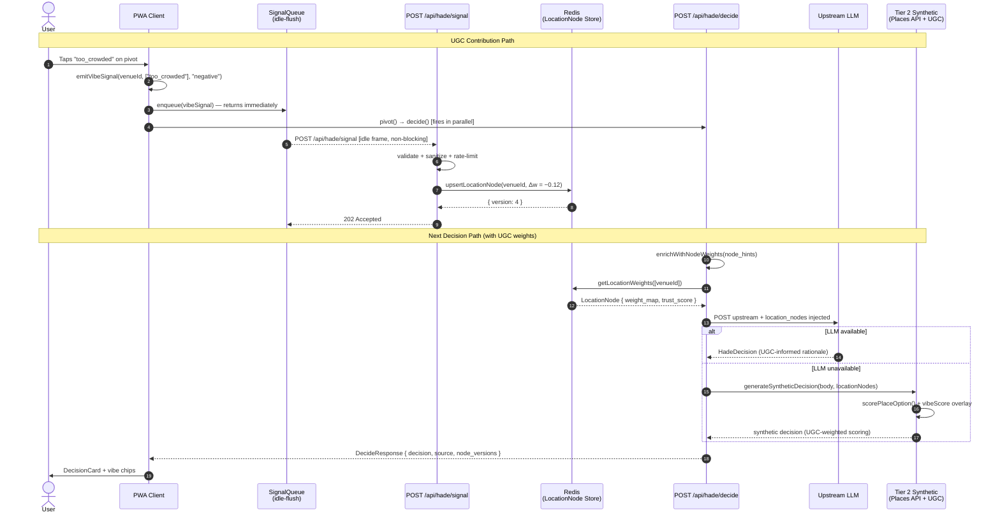

# HADE × UGC Full-System Audit

**Mode:** Principal Systems Designer
**Date:** 2026-04-18
**Version:** 2.0
**System:** HADE — Hyper-Adaptive Discovery Engine

---

## Pre-Audit State of the Codebase

The following was implemented prior to this audit and is **in production code**:

| Component | File | Status |
|:---|:---|:---:|
| `VibeSignal`, `LocationNode`, `ScoringWeights` types | `src/types/hade.ts` | ✅ Done |
| `SignalQueue` (idle-flush, retry backoff) | `src/lib/hade/queue.ts` | ✅ Done |
| `computeWeightDelta`, `upsertLocationNode` | `src/lib/hade/weights.ts` | ✅ Done |
| `POST /api/hade/signal` ingest route | `src/app/api/hade/signal/route.ts` | ✅ Done |
| `emitVibeSignal()` in `useAdaptive()` | `src/lib/hade/hooks.ts` | ✅ Done |
| `CommunitySignalToggle` with VibeTag picker | `src/components/hade/community/CommunitySignalToggle.tsx` | ✅ Done |
| Config-driven scoring weights, TTL, affinity maps | `src/config/*.json` | ✅ Done |
| `enrichWithNodeWeights()` in decide route | `src/app/api/hade/decide/route.ts` | ✅ Done |

This audit evaluates what remains, what is broken, and what must be built.

---

## A. System Gaps — Brutally Honest

### Critical — Breaks UGC Effectiveness Today

| # | Gap | File | Severity |
|:---|:---|:---|:---:|
| GAP-01 | **Synthetic tier ignores UGC entirely.** `scorePlaceOption()` in `synthetic.ts` uses `proximity × 0.6 + rating × 0.4`. LocationNode weights from `POST /api/hade/signal` are never consulted in Tier 2. When the LLM is down — the most common failure mode — UGC has zero effect on the decision. | `src/core/engine/synthetic.ts` | 🔴 Critical |
| GAP-02 | **Weights die on every cold start.** `globalThis.__hadeNodeRegistry` is an in-process Map. Every Vercel serverless invocation that cold-starts loses all accumulated UGC weight history. No network effect is possible. | `src/lib/hade/weights.ts` | 🔴 Critical |
| GAP-03 | **No user identity layer.** `source_user_id` on `VibeSignal` is nullable and unverified. `weightByTrust()` runs with `socialEdgeMap: {}` in production. One actor can flood any venue with maximum-strength signals in seconds. | `src/lib/hade/signals.ts` | 🔴 Critical |
| GAP-04 | **Demo page not wired to `emitVibeSignal()`.** `CommunitySignalToggle` in `demo/page.tsx` line 255 has no `venueId` or `onVibeSignal` prop. The entire UGC pipeline from the prior session is **unreachable from the UI**. | `src/app/demo/page.tsx` | 🔴 Critical |
| GAP-05 | **Denver hardcoded in demo page.** `const DEFAULT_GEO = { lat: 39.7392, lng: -104.9903 }` at line 51. When geolocation is denied, all signals and decisions anchor to Denver. LocationNodes created with Denver geo are meaningless for all non-Denver users. | `src/app/demo/page.tsx` | 🟠 High |

### High — Degrades Signal Quality Significantly

| # | Gap | File | Severity |
|:---|:---|:---|:---:|
| GAP-06 | **No real-time signal propagation between sessions.** User A submits a signal; User B's decide() 30 seconds later won't see it unless both hit the same warm serverless instance (extremely rare on Vercel). No WebSocket, SSE, or pub/sub layer exists. | Architecture | 🟠 High |
| GAP-07 | **UGC has no time decay after storage.** `computeWeightDelta()` applies `e^(-λt)` decay at submission time, but the stored `weight_map` value is static after write. A Friday-night "too_crowded" tag weighs equally on Sunday morning. | `src/lib/hade/weights.ts` | 🟠 High |
| GAP-08 | **No contribution experience on mobile.** `DecisionScreen` has `SecondaryActions` ("Not this" / "Refine") but no vibe feedback path. UGC contribution requires desktop debug mode (`?debug=1`). The highest-intent moment — user is physically at the venue — has no capture mechanism. | `src/components/hade/mobile/DecisionScreen.tsx` | 🟠 High |
| GAP-09 | **Signal strength is user-controlled in the demo.** The strength slider (0.1–1.0, default 0.7) allows users to trivially submit maximum-strength signals. In production UGC, strength must be derived server-side from context (recency, trust, proximity verification). | `src/app/demo/page.tsx` | 🟠 High |
| GAP-10 | **No PWA / service worker / offline capability.** `next.config.ts` has `reactStrictMode: true` and nothing else. No `next-pwa`, no `manifest.json`, no service worker. The signal queue in `useRef` is lost on every page close. App requires network for every interaction. | `next.config.ts` | 🟠 High |

### Medium — Limits Scale, Not Correctness

| # | Gap | File | Severity |
|:---|:---|:---|:---:|
| GAP-11 | **`aggregateSignals()` key collision on VibeSignals.** Key is `` `${sig.type}::${sig.venue_id}` ``. All VibeSignals use `type: "AMBIENT"` — two signals for the same venue are collapsed and strength-averaged, losing tag diversity. | `src/lib/hade/signals.ts` | 🟡 Medium |
| GAP-12 | **`HadeSettings.scoring_weights` never reaches Tier 2.** Defined in types, passed in `DecideRequest.settings`, but never extracted or forwarded into `generateSyntheticDecision()`. User weight overrides are silently ignored in fallback mode. | `src/core/engine/synthetic.ts` | 🟡 Medium |
| GAP-13 | **No UGC moderation or rate limiting.** `POST /api/hade/signal` validates VibeTag enum membership but has no per-device rate limit, no submission cap, no anomaly detection. Ten signals per second is trivial. | `src/app/api/hade/signal/route.ts` | 🟡 Medium |

---

## B. UGC Architecture Blueprint

### What HADE UGC Is — and Is Not

| ❌ Not This | ✅ This |
|:---|:---|
| Yelp review — async, retrospective, prose | Moment-bound, tag-based, time-contextual signal |
| TikTok content — engagement-optimized, algorithmic | Decision-input, not content |
| Reddit thread — unstructured, stale, high cognitive load | Structured schema, TTL-governed, ephemeral |
| Google star rating — aggregate popularity metric | Situational — Friday-night score ≠ Monday-morning score |

### Signal Taxonomy

```
HADE UGC Signal Types
│
├── VIBE_CHECK    — What it feels like right now
│     Tags: perfect_vibe, good_energy, dead, too_crowded, quiet, loud
│
├── LIVE_CONDITION — What is happening right now
│     Tags: crowd_level, wait_time override, open/closed
│
├── RECOMMENDATION — I just experienced this (requires dwell_time > 2 min)
│     Tags: worth_it, skip_it, hidden_gem, overpriced
│     Weight multiplier: 1.5× when distance_to_venue < 50m (verified visit)
│
└── WARNING       — Time-sensitive negative signal (TTL: 2 hours)
      Tags: closed_unexpectedly, wait_too_long, bad_scene
      Behaviour: overrides all positive vibe weights on the LocationNode
```

### Production VibeSignal Schema (additions required)

```typescript
interface VibeSignalV2 extends VibeSignal {
  // Identity — anonymous but stable across sessions
  device_fingerprint:        string;      // SHA-256(UA + timezone + language) — no PII

  // Moment context — auto-captured, never user-entered
  captured_at_time_of_day:   TimeOfDay;  // derived from emitted_at
  captured_at_day_type:      DayType;    // enables time-segmented weights

  // Observation classification
  observation_type:          "live_condition" | "recommendation" | "warning" | "vibe_check";

  // Optional quick-tap inputs
  crowd_level?:              "empty" | "sparse" | "moderate" | "packed";

  // Passive proximity verification
  distance_to_venue_meters?: number;     // was the user physically there?
  dwell_time_seconds?:       number;     // how long were they near the venue?
}
```

### Signal Flow: Current vs Target

```
CURRENT (broken — Tier 2 ignores UGC):
emit() → SignalQueue → POST /api/hade/signal → in-process Map
         → decide() → enrichWithNodeWeights() → Tier 1 (LLM) only
         Tier 2 (synthetic): proximity × 0.6 + rating × 0.4 — no UGC

TARGET:
emit() → SignalQueue → POST /api/hade/signal → Redis (shared across instances)
         → decide() → enrichWithNodeWeights() → location_nodes injected
           ├─ Tier 1: LLM upstream (receives location_nodes in request body)
           ├─ Tier 2: synthetic.ts scorePlaceOption() + vibe overlay  ← GAP-01 fix
           └─ Tier 2.5: IndexedDB cached venues + local weights       ← new (offline)
```

---

## C. UX/UI Integration Model

### Where UGC Appears in the User Journey

| Stage | Location | UGC Role | Display Rule |
|:---|:---|:---|:---|
| **Before suggestion** | Context panel | Social proof of area activity | "3 recent signals nearby — active area" — only if signal_count > 0 AND < 2h old |
| **During suggestion** | `DecisionCard` | Vibe modifier chips + trust indicator | Max 3 chips. No star ratings. Hide entirely if last_updated > 2h. |
| **After decision** | Bottom sheet (15 min deferred) | Primary UGC capture moment | "How was it?" — 3 chips, no text, 3 seconds |
| **On pivot** | Inline reason picker | Zero-extra-step capture | Maps to VibeTag automatically on "Not This" |

### Display Anti-Patterns — Prohibited

| Pattern | Rule |
|:---|:---|
| Feed of signals | Maximum 3 vibe chips per DecisionCard, always |
| Numeric scores | No star ratings, no percentages — contextual tags only |
| Empty state | Hide UGC section entirely when `signal_count === 0` |
| Scroll trap | All UGC in a single non-paginated card section |
| Review walls | Zero prose text from UGC in the suggestion view |

### Component Changes Required

| Component | File | Change |
|:---|:---|:---|
| `DecisionCard` | `src/components/hade/adaptive/DecisionCard.tsx` | Add `locationNodeVibe?: LocationNode` prop; render top 2–3 active vibe chips below rationale; show trust indicator when `signal_count > 0` AND `last_updated < 2h` |
| `DecisionScreen` | `src/components/hade/mobile/DecisionScreen.tsx` | After "Go now" tap: 15-min timer → `VibeSheet` bottom sheet; wire `CommunitySignalToggle` with active `venueId` |
| `PrimaryAction` | `src/components/hade/mobile/PrimaryAction.tsx` | On tap, store `venueId` + timestamp in parent state; parent triggers deferred UGC sheet |
| `demo/page.tsx` | `src/app/demo/page.tsx` | Pass `venueId`, `venueName`, `onVibeSignal` to `CommunitySignalToggle` (GAP-04 fix) |

---

## D. Contribution Flow Design

### Design Constraint: Sub-10 Seconds, Works In-Motion

**Flow 1 — Pivot capture (zero extra steps, highest volume)**

```
User taps "Not This"
→ 2-tap reason picker: ["Too crowded" · "Wrong vibe" · "Too far" · "Other"]
→ One tap auto-maps to VibeTag[] and fires emitVibeSignal()
→ pivot() fires simultaneously — no additional latency
Total: 1 extra tap. 0 seconds of added friction.
```

**Flow 2 — Deferred post-visit (3.5 seconds)**

```
"Go now" CTA tapped
→ 15-minute silent timer starts
→ Bottom sheet appears: "How's [Venue Name]?"
→ [Tap 1–3 emoji tag chips]   2.0 seconds
→ [Tap "Send"]                 1.0 second
→ [Confirmation animation]     0.5 seconds
Total: ~3.5 seconds. Highest trust — user was physically present.
```

**Flow 3 — Passive ambient (zero effort)**

```
GPS proximity < 50m + dwell_time > 2 minutes
→ Auto-emit PRESENCE signal with 1.5× trust multiplier
→ Optional nudge: "You seem to be at [Venue] — rate it?"
→ No action required for basic signal contribution
```

### Incentive Model

UGC in HADE uses an **intrinsic utility model only** — no points, no badges, no social karma.

The incentive is direct and immediate: a user who tags "too_crowded" on pivot sees the next suggestion actively avoid crowd-heavy venues **for their current session**. Contribution makes the system better for the contributor first, community second.

### Input Method Priority

| Priority | Method | When | Implementation |
|:---:|:---|:---|:---|
| 1 | **Tap-based tag chips** | All flows | Build now — MVP |
| 2 | **Pivot reason capture** | "Not This" tap | Build now — MVP |
| 3 | **Voice capture** | In-motion, hands full | V2 — Web Speech API → NLP → VibeTag |
| 4 | **Photo + auto-context** | Venue visit | V3 — Vision model extracts crowd, menu |

---

## E. Decision Engine Integration Logic

### UGC Scoring Overlay

**`scoreOpportunity()` — `src/lib/hade/engine.ts`**

```
base_score = proximity × 0.40 + signal × 0.35 + intent × 0.25
vibe_score = getNodeVibeScore(venue_id)          // 0–1; 0.5 = neutral
vibe_delta = (vibe_score − 0.5) × 0.30          // ±0.15 max modifier
final_score = clamp(base_score + vibe_delta, 0, 1)
```

**`scorePlaceOption()` — `src/core/engine/synthetic.ts` (GAP-01 fix)**

```
base_score = proximity × 0.60 + rating × 0.40
vibe_delta = (vibe_score − 0.5) × 0.20          // ±0.10 max for Tier 2
final_score = clamp(base_score + vibe_delta, 0, 1)
```

**Weight bounds — `src/lib/hade/weights.ts` (GAP-13 fix)**

```
new_weight = clamp(old + sign × Δw, 0.10, 0.90) // never absolute extremes
```

### UGC Confidence Modifier

```typescript
// Applied in _deriveUX() after base confidence is computed
function applyUGCConfidence(
  base: number,
  node: LocationNode | null,
): number {
  if (!node || node.signal_count < 2) return base;
  const vibeScore  = getNodeVibeScore(node.venue_id);
  const ageHours   = (Date.now() - new Date(node.last_updated).getTime()) / 3_600_000;
  const recency    = Math.exp(-0.2 * ageHours);  // halves every ~3.5 hours
  const modifier   = (vibeScore - 0.5) * 0.20 * recency;
  return Math.max(0, Math.min(1, base + modifier));
}
```

### UGC in the Refinement Loop

| Pivot Reason (user tap) | Auto-mapped VibeTag[] | Sentiment | Effect on Next Decision |
|:---|:---|:---:|:---|
| "Too crowded" | `[too_crowded]` | negative | Depresses crowded venues in score |
| "Wrong vibe" | `[dead, skip_it]` | negative | Reduces venue's composite vibe score |
| "Too far" | *(no vibe signal)* | n/a | Context update only — radius increase |
| "Overpriced" | `[overpriced]` | negative | Applies budget-weighted penalty |

### Sequence Diagram — UGC Signal-to-Decision



---

## F. Offline / Low-API Strategy

### Current State

| Tier | Trigger | Dependency | Result |
|:---:|:---|:---|:---|
| 1 | LLM available | Network + API key | Full LLM decision |
| 2 | LLM fails | Network + Google Places key | Synthetic decision |
| 3 | Both fail | None | "A spot nearby" — geo `{ lat: 0, lng: 0 }` — useless |

### Target State

| Tier | Trigger | Dependency | Result |
|:---:|:---|:---|:---|
| 1 | LLM available | Network + API keys | Full LLM decision with UGC overlay |
| 2 | LLM fails | Network + Places key | Synthetic decision with UGC scoring |
| 2.5 | Places API fails | Network-optional (IndexedDB) | **NEW** — Cached venues + local LocationNode weights |
| 3 | All APIs fail, no cache | Device only | "Based on recent local signals" — UGC-only rationale |
| 4 | Absolute last resort | None | Static fallback with caller's geo |

### Implementation Requirements

| Component | Purpose | Package |
|:---|:---|:---|
| `IndexedDB` venue cache | Persist `fallback_places[]` keyed by 1km geo-hash, 6h TTL | `idb-keyval` (1.5kb) |
| `localStorage` node version cache | Fast UGC read without Redis round-trip | Native |
| Background Sync API | Drain `SignalQueue` to server when network resumes | Service Worker |
| PWA manifest | Enable "Add to home screen", full-screen, portrait lock | `next-pwa` |

### Offline UX Rules

```
When offline detected:
  → SignalQueue persists to IndexedDB (not lost on page close)
  → Decision attempt reads cached venues + local LocationNode weights
  → Confidence capped at 0.55 (displayed as "Based on recent local signals")
  → Banner: "Using cached signals — syncing when online"
  → No empty states — always attempt a decision
```

---

## G. Risk & Failure Analysis

### Failure Mode 1: Noise Overload (Medium Probability, High Impact)

**Scenario:** Coordinated boosting — a group submits 200 "perfect_vibe" signals for one venue in one hour. Or a competing operator runs a script to tank a rival's weights.

**Impact:** Engine recommendation diversity collapses. One venue dominates all decisions in an area.

| Mitigation | Implementation |
|:---|:---|
| Per-device rate limit | Sliding window: 10 signals/minute. Redis counter keyed by `device_fingerprint`. |
| Weight bounds | Floor 0.10, ceiling 0.90 — never absolute extremes. Already designed; needs floor added. |
| Velocity outlier detection | If `signal_count` for a venue exceeds 3σ above median for comparable venues in 1h, flag for review. |
| Trust discount for new devices | Devices with < 5 lifetime contributions: weight multiplier 0.5× until threshold is reached. |

### Failure Mode 2: Zero Participation (Certainty at Launch)

**Scenario:** System launches. Users discover the product independently. No social graph. No one contributes UGC. All `LocationNode.signal_count = 0`.

**Impact:** None on decision quality — graceful degradation to baseline scoring. But the community signals brand promise is hollow from day one.

| Mitigation | Implementation |
|:---|:---|
| Seed from Places API ratings | On every Tier 2 success: `trust_score = (rating − 1) / 4`; neutral `weight_map` baseline. Non-empty registry from day one. |
| Capture on pivot | Zero-extra-step contribution — user is already expressing a preference. No activation energy required. |
| Conditional UGC display | Show vibe chips only when `signal_count > 0`. No empty state pollution. |

### Failure Mode 3: Demographic Bias Loops (Medium Probability, Long-Term Impact)

**Scenario:** A cafe near a tech campus accumulates "perfect_vibe" signals exclusively from weekday-lunch engineers. HADE over-recommends it to all users regardless of their group type, time, or vibe preference.

**Impact:** Engine becomes a popularity ranker over time. Discovery and spontaneity collapse.

| Mitigation | Implementation |
|:---|:---|
| Time-segmented weights | `weight_map` keyed by `{tag}:{time_of_day}:{day_type}` — Friday night weights don't affect Monday morning. |
| Diversity injection | No venue holds > 40% of recommendations in a session. |
| Exploration temperature | `HadeSettings.exploration_temp` set to "explorative" actively disfavors top-weighted venues via score inversion. |

### Failure Mode 4: Stale Data — Venue Closure (High Probability Without Mitigation)

**Scenario:** A bar accumulates 50 "perfect_vibe" signals then closes permanently. HADE continues recommending it for weeks.

**Impact:** User arrives at a closed business. Trust destroyed. Potentially irreversible churn.

| Mitigation | Implementation |
|:---|:---|
| Signal TTL at submission | `emitted_at` + `expires_at` governs weight validity. `filterExpiredSignals()` runs before every weight read. |
| Staleness decay | If `LocationNode.last_updated > 48h` with no new signals, decay all `weight_map` values toward 0.5 at read time. |
| WARNING signal override | `observation_type: "warning"` with tag `closed_unexpectedly` → overrides all vibe scores, sets confidence floor to 0.1, TTL 2h. |
| Open-now filter | Tier 2 Places API call always includes `open_now: true`. Prevents serving closed venues at the source. |

### Failure Mode 5: Privacy Exposure (Low Probability, Catastrophic Impact)

**Scenario:** A user submits a VibeSignal from a location they didn't intend to disclose — a medical clinic, a religious institution, an address they frequent privately.

**Impact:** Legal and trust catastrophe. GDPR/CCPA exposure.

| Mitigation | Implementation |
|:---|:---|
| Geo snapping | Signal geo stored at 100m grid cell precision — not exact GPS coordinates. |
| Device fingerprint only | One-way SHA-256 hash of browser attributes. No PII stored anywhere in the pipeline. |
| `source_user_id` never exposed | Field is never returned in any client-facing API response. |
| `shareable` defaults false | User must explicitly opt in to community broadcasting via the toggle. |
| GDPR delete path | `DELETE /api/hade/signal?device={fingerprint}` — zeroes all `weight_map` contributions from that device across all LocationNodes. |

---

## H. Phased Implementation Plan

### Phase 0 — Critical Fixes (This Session — ~4 Hours)

*These gaps make the entire prior session's work unreachable.*

| # | Task | File(s) | Est. |
|:---:|:---|:---|:---:|
| 1 | Wire `emitVibeSignal` + `venueId` + `venueName` + `onVibeSignal` into `CommunitySignalToggle` in demo page | `src/app/demo/page.tsx` | 20m |
| 2 | Wire same props into `DecisionScreen` mobile path | `src/components/hade/mobile/DecisionScreen.tsx` | 30m |
| 3 | Remove Denver `DEFAULT_GEO` from demo page; add null geo guard and "location required" UI state | `src/app/demo/page.tsx` | 10m |
| 4 | Inject UGC vibe score overlay into `scorePlaceOption()` (GAP-01) | `src/core/engine/synthetic.ts` | 45m |
| 5 | Thread `location_nodes` param into `generateSyntheticDecision()` | `src/app/api/hade/decide/route.ts` + `src/core/engine/synthetic.ts` | 30m |
| 6 | Add weight floor (0.10) and ceiling (0.90) to `upsertLocationNode()` | `src/lib/hade/weights.ts` | 10m |
| 7 | Add per-device rate limiting to `POST /api/hade/signal` | `src/app/api/hade/signal/route.ts` | 45m |

### Phase 1 — MVP Core (Next 2 Weeks)

*Goal: UGC improves decisions measurably. Works without network effects.*

| # | Task | Priority |
|:---:|:---|:---:|
| 1 | **Upstash Redis adapter** for `weights.ts` — env-var activated, Map fallback for local dev. Key: `hade:node:{venue_id}`, TTL: 7 days. | P0 |
| 2 | **Anonymous device fingerprint** as `source_user_id` in `emitVibeSignal()` — SHA-256, localStorage-persisted, one-way only. | P0 |
| 3 | **UGC capture on pivot** — modify `pivot()` to accept `PivotReason`, map to `VibeTag[]`, call `emitVibeSignal()` before `decide()`. | P1 |
| 4 | **Vibe chips on `DecisionCard`** — read `LocationNode` from `DecideResponse`, render top 2 positive / 1 negative chip. Show only if `signal_count > 1` AND `last_updated < 2h`. | P1 |
| 5 | **Deferred "How was it?" sheet** — 15-min `setTimeout` after "Go now" tap, `VibeSheet` bottom sheet, pre-populated venue. | P1 |
| 6 | **Seed registry from Places API ratings** — on Tier 2 success, `rating → trust_score` seeding so registry is never empty from day one. | P2 |
| 7 | **Fix GAP-11** — VibeSignal `aggregateSignals()` key: `` `VIBE::${location_node_id}::${vibe_tags.sort().join(",")}` `` | P2 |

### Phase 2 — Network Effects (Month 2)

| # | Task |
|:---:|:---|
| 1 | **SSE / 60-second polling** for real-time weight updates — `GET /api/hade/signals?venue_id={id}` returns fresh `LocationNode` if `version` changed |
| 2 | **Time-contextual weight segmentation** — `weight_map` keyed by `{tag}:{time_of_day}:{day_type}` to prevent temporal bias |
| 3 | **AI summarization agent** — when `signal_count > 8` in a 2h window, background agent produces a natural-language summary stored on `LocationNode`; used in `DecisionCard` rationale |
| 4 | **PWA + Service Worker** — `next-pwa` integration, `BackgroundSync` for offline queue drain, `manifest.json` |
| 5 | **Staleness decay at read time** — `last_updated > 48h` with no new signals → decay all weights toward 0.5 |

### Phase 3 — Intelligence Layer (Month 3+)

| # | Task |
|:---:|:---|
| 1 | **Location-verified signals** — `distance_to_venue_meters < 50` + `dwell_time_seconds > 120` → weight multiplier 1.5× ("✓ Visited" badge on chip) |
| 2 | **Voice signal capture** — Web Speech API → NLP (regex/keyword MVP, LLM V2) → `VibeTag[]` extraction |
| 3 | **Cross-session preference profiles** — `UserPreferenceProfile { crowd_aversion, budget_sensitivity }` built from UGC history, stored in localStorage for privacy, applied as per-user scoring multiplier |
| 4 | **Full offline fallback (Tier 2.5)** — `IndexedDB` cached venues + local `LocationNode` weights → valid decision with `source: "ugc_offline"`, confidence cap 0.55 |
| 5 | **GDPR delete path** — `DELETE /api/hade/signal?device={fingerprint}` clears all contributions from a device across all LocationNodes |

---

## Key Reusable Functions — Do Not Rewrite

| Function | File | Reuse In |
|:---|:---|:---|
| `weightByTrust(signals, edgeMap)` | `src/lib/hade/signals.ts` | Extend with device trust factor in Phase 1 |
| `aggregateSignals(signals)` | `src/lib/hade/signals.ts` | Fix key for VibeSignals (GAP-11) then reuse |
| `filterExpiredSignals(signals)` | `src/lib/hade/signals.ts` | Call before every weight read — never bypass |
| `computeWeightDelta(signal)` | `src/lib/hade/weights.ts` | Correct implementation — reuse as-is |
| `getNodeVibeScore(venueId)` | `src/lib/hade/weights.ts` | Single read API for all scoring overlays |
| `haversineDistanceMeters(a, b)` | `src/lib/hade/engine.ts` | Proximity verification for trust multiplier |
| `generateSituationSummary(ctx)` | `src/lib/hade/engine.ts` | UGC context tagging — time-segment the weight keys |

---

## Summary Scorecard

| Dimension | Current State | Target State | Phase |
|:---|:---:|:---:|:---:|
| UGC ingest endpoint | ✅ Built | ✅ Done | — |
| UGC in Tier 1 (LLM) | ✅ node_hints injected | ✅ Done | — |
| UGC in Tier 2 (synthetic) | ❌ Ignored | Vibe overlay on scorePlaceOption | 0 |
| Weight persistence | ❌ In-process Map | Redis / Upstash | 1 |
| Demo page wiring | ❌ Disconnected | emitVibeSignal + venueId props | 0 |
| Mobile contribution | ❌ None | DecisionScreen VibeSheet | 1 |
| Rate limiting | ❌ None | Per-device sliding window | 0 |
| Real-time propagation | ❌ None | SSE / polling + Redis | 2 |
| Offline capability | ❌ None | IndexedDB + BackgroundSync | 2 |
| Time-segmented weights | ❌ None | weight_map keyed by time bucket | 2 |
| Voice / ambient capture | ❌ None | Web Speech API | 3 |
| Location verification | ❌ None | Proximity + dwell multiplier | 3 |

---

*Generated by Claude — HADE Component System Architectural Audit*
*Repository: `/Users/danielmeier/Documents/GitHub/HADE Component System`*
